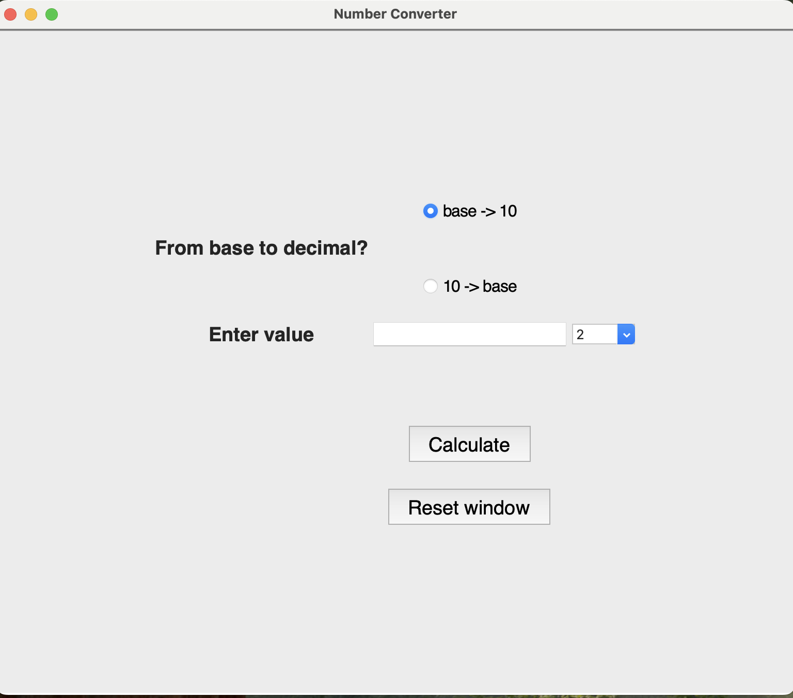
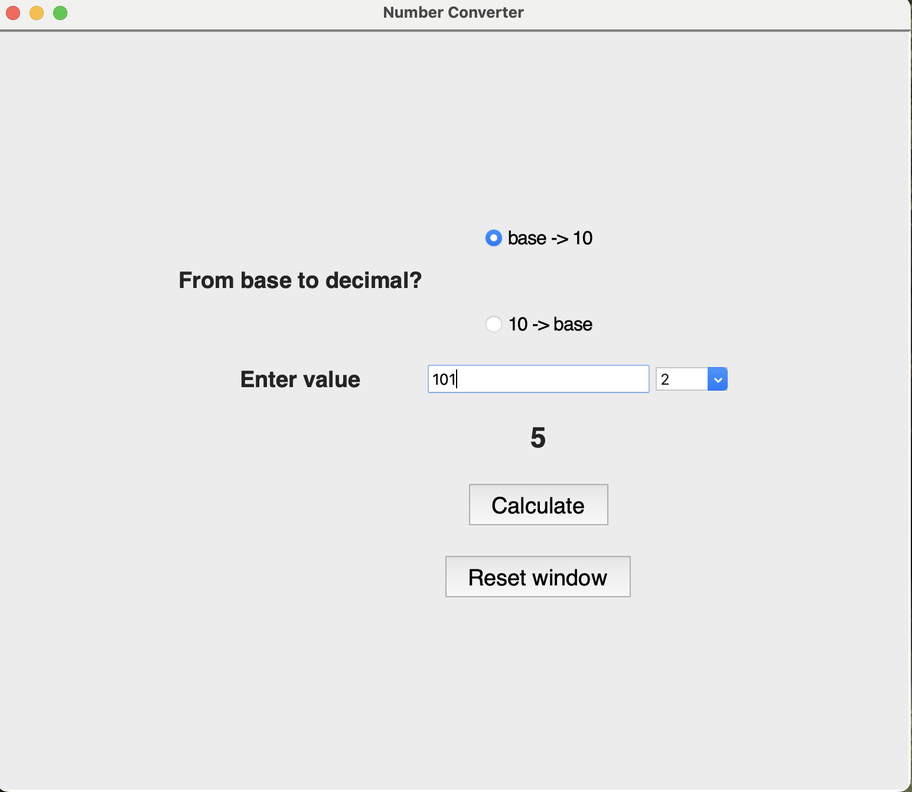
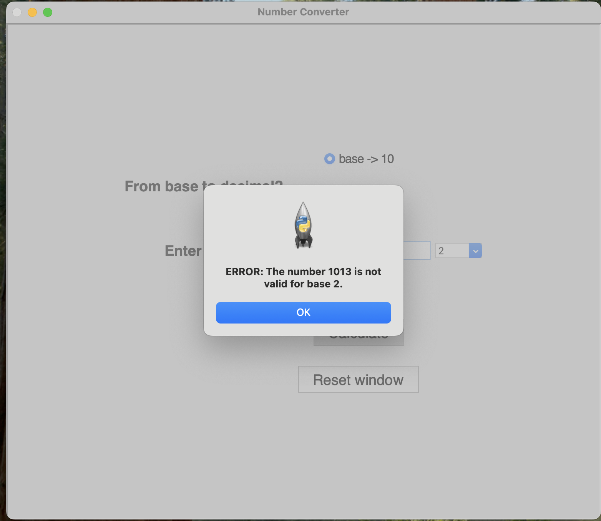
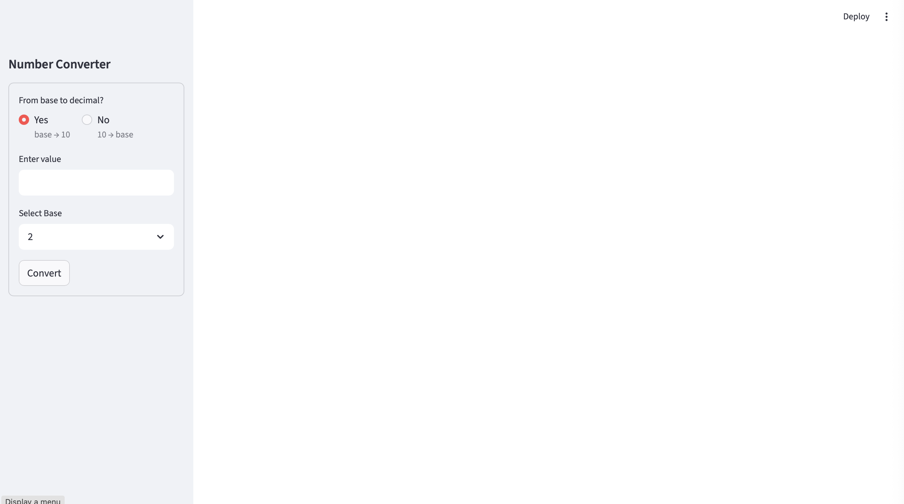
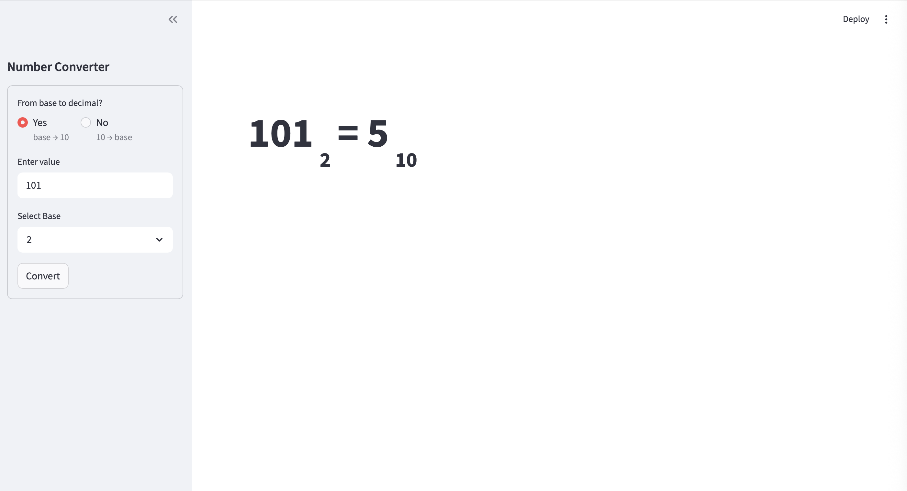
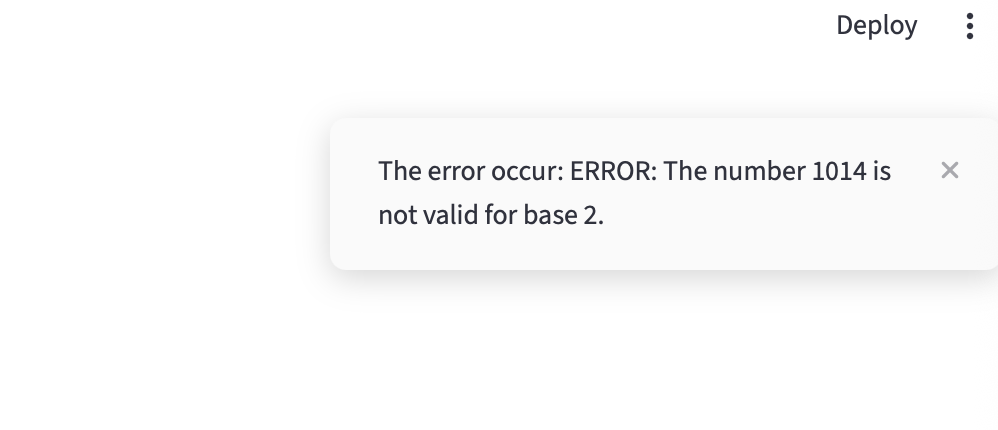

# Number converter

## Final Project for CSC.221.40C Introduction to Problem Solving and Programming course.

This application allows to convert numbers from base 10 to bases 2, 8, 16 and vice versa. 

The functions to convert to decimal and to bases 2, 8, and 16 are in base_conversion.py file.

The goal was to implement this conversion using custom function with additional error handling.

__Project structure__

- base_conversion.py holds functions to convert data
- graphic.py contain code for tkinter graphic user interface. 
- streamlit_number_converter.py contain code for streamlit deployment: 

To run locally:
- clone repository

For graphic.py file: 
- requires Python and Tkinter to be installed on your system.
- run graphic.py file

For streamlit_number_converter.py file: 
- requires Python and Streamlit to be installed on your system.
- command to run streamlit application locally: `streamlit run streamlit_number_converter.py`

**Tkinter GUI screenshots:**

_- main page_

_- conversion result_

_- error message_

**Steamlit screenshots:**

_- main page_

_- conversion result_

_- error message_

